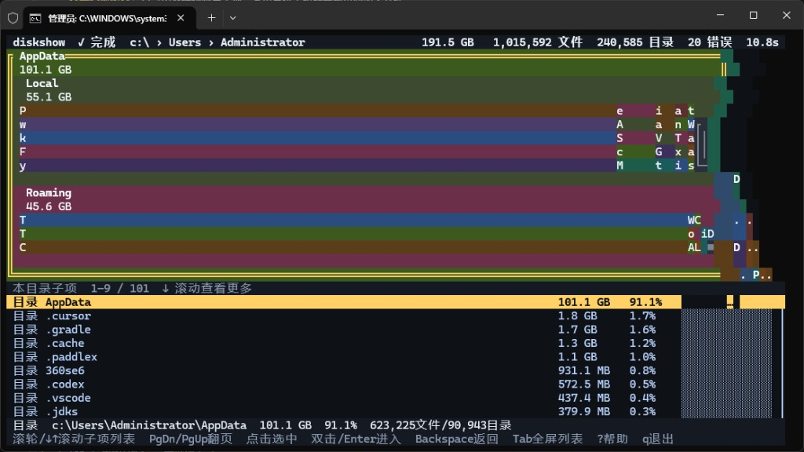

# diskshow

终端里的磁盘占用分析器。交互接近 [SpaceSniffer](http://www.udc.cz/spacesniffer/)：用嵌套矩形树图看谁在吃空间，点击即可下钻到子目录。

[](https://go.dev/)
[](#安装)

<p align="center">
  
</p>

<p align="center">
  <sub>扫描 <code>C:\Users\Administrator</code>：191.5 GB · 1,015,592 文件 · 240,585 目录 · 10.8s</sub>
</p>

上图里 `AppData` 占了约 101 GB（91%）。矩形面积按占用比例绘制，目录内部继续嵌套；下方列表按大小排序，一屏看不完时用滚轮或方向键浏览其余 101 项。

## 特性

- **面积即占用** — 越大的文件/目录，矩形越大，空间大户一眼能看出来
- **嵌套树图** — 目录内部继续画出子项，不必先进入也能看到里面的大文件
- **点击下钻** — 左键选中最内层矩形，双击或 <kbd>Enter</kbd> 进入该目录
- **实时扫描** — 扫描过程中矩形随结果长大，不用等全部扫完
- **可滚动列表** — 当前目录全部子项按大小排列，滚轮 / <kbd>↓</kbd><kbd>↑</kbd> / <kbd>PgDn</kbd> 查看一屏装不下的项目
- **并发扫盘** — 跳过回收站、系统目录和符号链接/联接，避免循环与权限噪声

## 安装

需要 [Go 1.21+](https://go.dev/dl/)。Windows 建议在 [Windows Terminal](https://aka.ms/terminal) 中运行，以获得鼠标与真彩色支持。

```bash
git clone https://github.com/showx/diskshow.git
cd diskshow
go build -o diskshow.exe .
```

构建产物为当前目录下的 `diskshow.exe`（其他平台可去掉 `.exe`）。

## 用法

```text
diskshow [选项] [目录]
```

不传目录时扫描当前工作目录。

```bash
diskshow
diskshow D:\code
diskshow C:\Users
```

| 选项 | 说明 |
|------|------|
| `-skip-hidden` | 跳过名称以 `.` 开头的隐藏项 |
| `-all` | 包含回收站、`System Volume Information` 等特殊目录 |
| `-version` | 显示版本号 |

默认会忽略 `$Recycle.Bin`、`System Volume Information`、页面文件以及符号链接/目录联接。

## 操作

| 按键 / 鼠标 | 作用 |
|-------------|------|
| 滚轮 / <kbd>↓</kbd> <kbd>↑</kbd> | 滚动子项列表 |
| <kbd>PgDn</kbd> / <kbd>PgUp</kbd> | 列表翻页 |
| 鼠标左键 | 选中矩形或列表行 |
| 双击 / <kbd>Enter</kbd> | 进入目录 |
| 右键 / <kbd>Backspace</kbd> | 返回上一级 |
| <kbd>Tab</kbd> | 树图+列表 ↔ 全屏列表 |
| <kbd>j</kbd> <kbd>k</kbd> | 同级项目间移动（列表跟着滚） |
| <kbd>o</kbd> | 在资源管理器中定位选中项 |
| <kbd>?</kbd> | 帮助 |
| <kbd>q</kbd> | 退出 |

## 工作方式

扫描阶段用有限并发遍历目录树，把每个节点的大小、文件数和子项实时汇总到界面。布局使用 squarified treemap：同一层按占用比例划分矩形，空间足够时再向内嵌套。终端格子较粗，小项目在树图里可能只剩一条色带，因此下方始终保留完整列表，避免一屏看不全就丢数据。

## 许可

尚未指定开源许可证。公开发布前请先补充 `LICENSE`。
